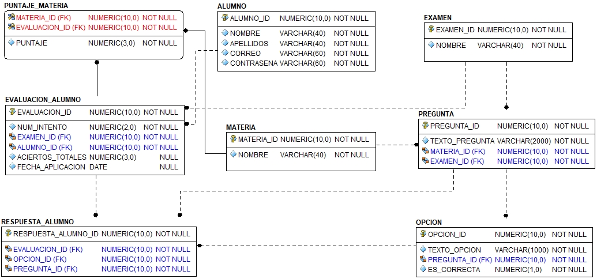

= Base de datos
Creado por Rodrigo Francisco <rhodfra@gmail.com>
Version 1.0, 26.06.2021
:toc: 
:toc-placement!:
:toclevels: 4                                          
:toc-title: Contenido
:source-highlighter: pygments
ifndef::env-github[:icons: font]
ifdef::env-github[]
:caution-caption: :fire:
:important-caption: :exclamation:
:note-caption: :paperclip:
:tip-caption: :bulb:
:warning-caption: :warning:
endif::[]

== Modelo

== Comandos

[source,]
----
psql -U diplomado -d upperquizz
----

